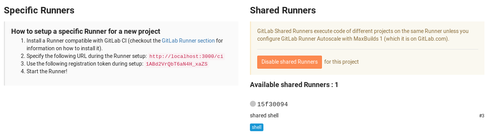
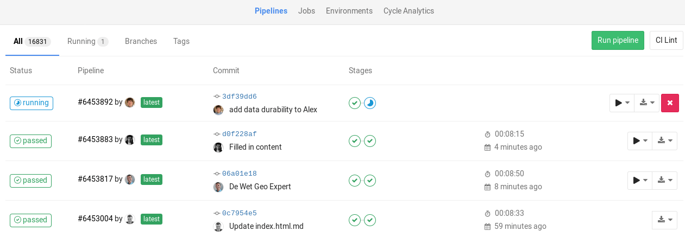
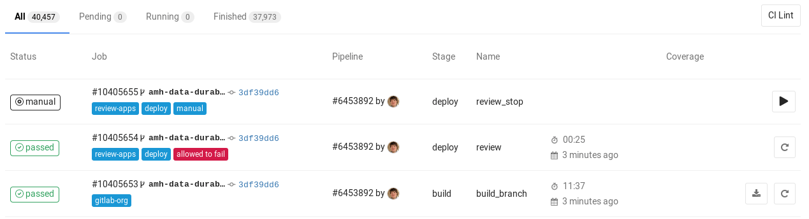
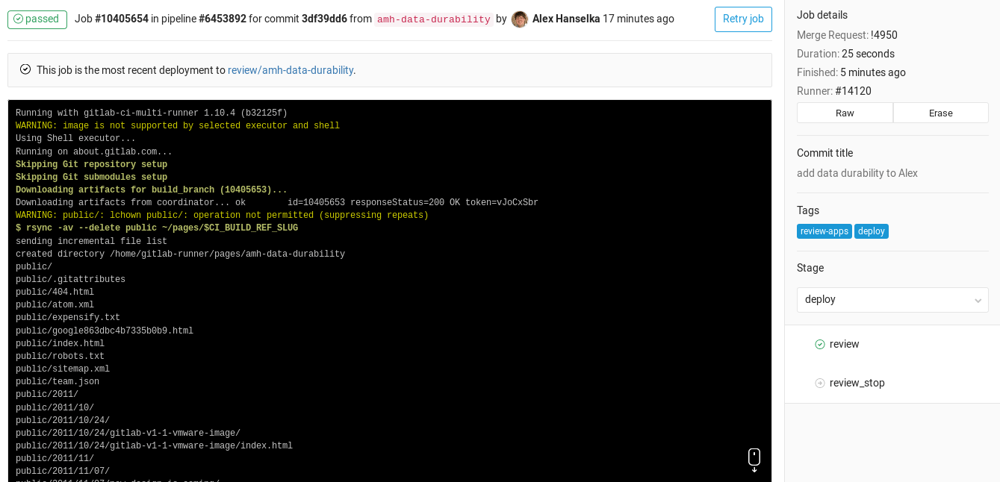

# 开始使用GitLab CI/CD

GitLab提供持续集成服务。如果将[.gitlab-ci.yml](https://docs.gitlab.com/ee/ci/yaml/README.html)文件添加到存储库的根目录，并将GitLab项目配置为使用Runner，则每次提交或推送都会触发CI pipelines。  

`.gitlab-ci.yml`文件告诉GitLab运行器该做什么。默认情况下，它运行一个包含三个阶段的Pipelines：`build`，`test`和`deploy`。你不需要使用所有三个阶段;没有作业的阶段会被忽略了。 

如果一切运行正常（没有非零返回值），将获得与提交相关联的漂亮绿色复选标记。这样可以在查看代码之前轻松查看提交是否导致任何测试失败。   

大多数项目使用GitLab的`CI`服务来运行测试套件，以便开发人员在破坏某些内容时立即获得反馈。

使用持续交付和持续部署将测试代码自动部署到登台和生产环境的趋势越来越明显。简而言之，具有工作的CI所需的步骤可归纳为：  
- 将`.gitlab-ci.yml`添加到存储库的根目录
- 配置一个`Runner`    

从那时起，在每次推送到Git存储库时，`Runner`将自动启动`Pipelines`，`Pipelines`将显示在项目的`Pipelines`页面下。

# 创建.gitlab-ci.yml文件

在创建`.gitlab-ci.yml`之前，首先简要解释一下这是什么

# 什么是.gitlab-ci.yml

可以在`.gitlab-ci.yml`文件中配置`CI`对项目执行的操作。它位于存储库的根目录中。 

在任何推送到存储库时，GitLab将查找`.gitlab-ci.yml`文件，并根据该文件的内容在`Runners`上启动该提交的作业。  

因为`.gitlab-ci.yml`在存储库中并且受版本控制，旧版本仍然可以成功构建，分支可以轻松地使用`CI`，分支可以具有不同的`Pipelines`和作业，并且只有`CI`的单一事实来源。在这个[博客](https://about.gitlab.com/2015/05/06/why-were-replacing-gitlab-ci-jobs-with-gitlab-ci-dot-yml/)中详细了解使用`.gitlab-ci.yml`的原因

# 创建一个简单的.gitlab-ci.yml文件

注意：`.gitlab-ci.yml`是一个[YAML](https://en.wikipedia.org/wiki/YAML)文件，因此必须特别注意缩进。始终使用`空格`，而不是`tabs`。

需要在存储库的根目录中创建名为`.gitlab-ci.yml`的文件。下面是`Ruby on Rails`项目的示例。

    before_script:
    - apt-get update -qq && apt-get install -y -qq sqlite3 libsqlite3-dev nodejs
    - ruby -v
    - which ruby
    - gem install bundler --no-ri --no-rdoc
    - bundle install --jobs $(nproc)  "${FLAGS[@]}"
    rspec:
    script:
        - bundle exec rspec

    rubocop:
    script:
        - bundle exec rubocop

这是最简单的配置，适用于大多数`Ruby`应用程序：
1. 使用要执行的不同命令定义两个作业rspec和rubocop（名称是任意的）。
2. 在每个作业之前，执行before_script定义的命令。

`.gitlab-ci.yml`文件定义了具有运行方式和时间约束的作业集。作业被定义为具有名称的顶级元素（在我们的示例中为rspec和rubocop），并且始终必须包含`script`关键字。`Jobs`用于创建作业，然后由`Runners`选择并在`Runner`环境中执行。

重要的是每项作业都是相互独立运作的。

如果要检查项目的`.gitlab-ci.yml`是否有效，则在项目命名空间的页面`/ ci / lint`下有一个`Lint`工具。在你的项目中`CI/CD➔Pipelines`和`Pipelines➔Jobs`还可以找到一个`CI Lint`按钮

有关更多信息和完整的`.gitlab-ci.yml`语法，请阅读[.gitlab-ci.yml](https://docs.gitlab.com/ee/ci/yaml/README.html)上的参考文档。

# 将.gitlab-ci.yml推送到GitLab

一旦创建了`.gitlab-ci.yml`，应该将它添加到Git存储库并将其推送到GitLab。

    git add .gitlab-ci.yml
    git commit -m "Add .gitlab-ci.yml"
    git push origin master

现在，如果转到`Pipelines`页面，将看到`Pipelines`处于`pending`状态。

- 注意：如果你有一个[GitLab来自的镜像存储库](https://docs.gitlab.com/ee/workflow/repository_mirroring.html#pulling-from-a-remote-repository)，可能需要在项目中启用`pipeline`触发
`Settings > Repository > Pull from a remote repository > Trigger pipelines` 去镜像更新。

也可以转到`commit`页面，注意提交SHA旁边的小暂停图标。

单击它，将被定向到该特定commit的作业页面。

注意，有一个挂起的作业以我们在`.gitlab-ci.yml`中写的命名。`stuck`表示尚未为此作业配置`Runner`。下一步是配置一个`Runner`，以便它选择`pending`的作业。

# 配置Runner

在GitLab中，`Runners`运行在`.gitlab-ci.yml`中定义的作业。`Runner`可以是虚拟机，VPS，裸机(bare-metal machine)，docker容器甚至是容器集群。GitLab和`Runners`通过API进行通信，因此唯一的要求是`Runner`的机器可以访问GitLab服务器。

`Runner`可以特定于某个项目，也可以在GitLab中提供多个项目。如果它服务于所有项目，则称为共享运行者(Shared Runner)。

[Runners文档](https://docs.gitlab.com/ee/ci/runners/README.html)

可以通过转到`Settings➔CI/ CD`找到是否为项目分配了任何`Runners`。设置`Runner`简单明了。由GitLab支持的官方`Runner`是用`Go`编写的，文档-> https://docs.gitlab.com/runner/ 

要获得功能性`Runner`，需要执行以下两个步骤：
- [安装](https://docs.gitlab.com/runner/install/)
- [配置](https://docs.gitlab.com/ee/ci/runners/README.html#registering-a-specific-runner)

按照上面的链接设置自己的`Runner`或使用`Shared Runner`，如下一节所述。

一旦设置了`Runner`，应该在项目的`Runners`页面上能看到它 `Settings ➔ CI/CD.`

# 共享Runners

如果使用[GitLab.com](https://about.gitlab.com/)，可以使用GitLab Inc.提供的`Shared Runners`

这些是在GitLab基础架构上运行的特殊虚拟机，可以构建任何项目。

要启用共享运行程序，必须转到项目的`Settings➔CI/ CD`并单击`Enable shared runners`

[了解更多关于Shared Runners](https://docs.gitlab.com/ee/ci/runners/README.html)

# 查看pipeline和jobs的状态

成功配置`Runner`后，应该会看到上次提交的状态从挂起更改为`pending`，`success`或`failed`。可以转到项目的`pipeline`页面来查看所有`pipelines`。

或者可以通过`pipeline➔jobs`页面查看所有作业

通过单击作业的状态，能够看到该作业的日志。这对于诊断失败或行为与预期不同的原因非常重要。

还可以在GitLab的各个页面中查看任何提交的状态，例如`commit`和`Merge requests`

# 例子

访问[示例README](https://docs.gitlab.com/ee/ci/examples/README.html)，查看使用各种语言的GitLab CI的示例列表